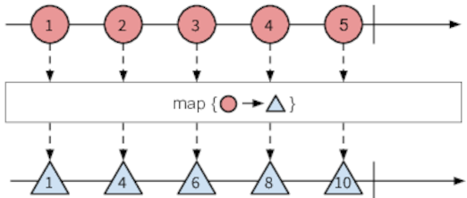

# Chapter 2 - Deep in the Sequence

## Visualising Observables

- _Marble diagrams_ are often used for visualising Observables and the effects of operators on them:


- Example marble diagram for the `range` operator:


- Example marble diagram for the `merge` operator:


## Basic Sequence Operators

- Most commonly-used operators are the standard sequence-based operators `map`, `filter` and `reduce`.

- `map` takes an Observable and a mapping function.  It applies the mapping function to the values in the source Observable, and emits the transformed values as a new Observable:



- This is a bit like the `map` function on an array:

    ```javascript
    // Arrays
    const src = [1, 2, 3, 4, 5];
    const doubled = src.map(i => i * 2);
    doubled.forEach(i => console.log(i));

    // Observables
    const src = Rx.Observable.range(1, 5);
    const doubled = src.map(i => i * 2);
    doubled.subscribe(i => console.log(i));
    ```
