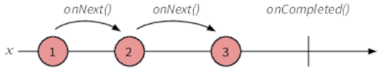
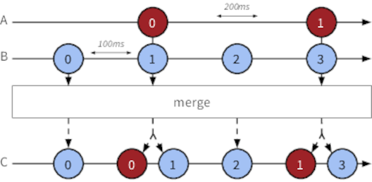

# Chapter 2 - Deep in the Sequence

## Visualising Observables

- _Marble diagrams_ are often used for visualising Observables and the effects of operators on them:

- Example marble diagrams for the `range` operator:

- Example marble diagrams for the `merge` operator:

