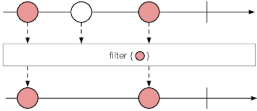
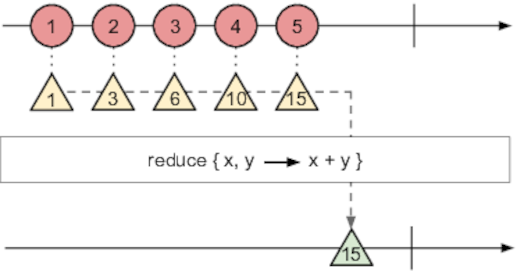

# Chapter 2 - Deep in the Sequence

## Visualising Observables

- _Marble diagrams_ are often used for visualising Observables and the effects of operators on them:


- Example marble diagram for the `range` operator:


- Example marble diagram for the `merge` operator:


## Basic Sequence Operators

- Most commonly-used operators are the standard sequence-based operators `map`, `filter` and `reduce`.

- `map` takes an Observable and a mapping function.  It applies the mapping function to the values in the source Observable, and emits the transformed values as a new Observable:


- This is a bit like the `map` function on an array:

    ```javascript
    // Arrays
    const src = [1, 2, 3, 4, 5];
    const doubled = src.map(i => i * 2);
    doubled.forEach(i => console.log(i));

    // Observables
    const src = Rx.Observable.range(1, 5);
    const doubled = src.map(i => i * 2);
    doubled.subscribe(i => console.log(i));
    ```

- `filter` takes an Observable and a predicate function.  It tests each element in the Observable and returns a new Observable of all the elements for which the predicate evaluates to `true`:



- `reduce` (a.k.a. `fold`) takes an Observable and returns a new one that contains only a single item - the result of applying the _accumulating function_ over each element:



- The accumulating function takes two arguments, often called `acc` (accumulator) and `x` (next value), and returns the new value of the accumulator:

    ```javascript
    const range = Rx.Observable.range(1, 10);
    const sum = range.reduce((acc, x) => acc + x);

    // Can also pass in an initial argument for `reduce`
    const count = range.reduce(((acc, x) => acc + 1)), 0);
    ```

- Can also use `scan`, which is a variant of `reduce` that emits intermediate values of the accumulation - useful for reducing over infinite Observables.

- In some cases, you can have an Observable whose results are more Observables?
    - Most of time you want to 'flatten' items in the nested Observables into a single sequence.
    - `flatMap` takes an Observable `A` and a mapping function that creates a new Observable from each item in `A`.
    - It applies the mapping functions, then flatten the emissions from those into a single Observable.


## Cancelling Sequences

- One disadvantage of using callbacks / promises for async communications is that they can't easily be cancelled (althoug some promise implementations _do_ support cancellation).

- We can cancel Observables either _implicitly_ or _explicitly_.

- Explicit cancellation is done using a _Disposable_, which is returned when we create a subscription.  We can then call `dispose()` on the result:

    ```javascript
    const counter = Rx.Observable.interval(1000);

    const subscription1 = counter.subscribe(i => console.log("Subscription 1: ", i));
    const subscription2 = counter.subscribe(i => console.log("Subscription 2: ", i));

    setTimeout(() => {
        console.log("Cancelling subscription 2!");
        subscription2.dispose();
    }, 2000);
    ````

- Note that, when cancelled, subscribed Observer's don't have their `onComplete()` method called.

- Most of the time, operators will implicitly and automatically cancel subscriptions for you, e.g.:
    - `range` and `take` will cancel the subscription when the sequence finishes or the operator conditions are met.

- When using Observables that wrap external APIs that don't provide cancellation, the Observable will stop emitting when cancelled, but not necessarily the underlying API.

- For example:

    ```javascript
    const p = new Promise((resolve, reject) =>
        // This still gets called, even after the subscription to it is disposed
        setTimeout(resolve, 5000)
    );
    p.then(() => console.log("Potential side-effect!"));

    const subscription = Rx.Observable.fromPromise(p)
        .subscribe(() => console.log("Observable resolved!"));

    subscription.dispose();
    ```

- So, it's important to know the details of external APIs that are used in Observables:
    - You might think you've cancelled a sequence, but the underlying API continues running.
    - This may lead to later side-effects and subtle errors.

## Handling Errors

- Conventional error handling mechanisms using try / catch are synchronous, so they can't be used in callbacks:
    - The handler would run before any async code, so wouldn't be able to catch errors.
    - With callbacks, this was solved by passing the error as a parameter to the callback function.

- Errors in Observables are handled by the `onError` function in subscribed Observers:

    ```javascript
    observable.subscribe(
        x    => console.log("Next: ", x),      // onNext()
        err  => console.log(err.message),      // onError()
        ()   => console.log("Completed"));     // onCompleted()
    ```

- If `onError()` is triggered, then `onCompleted()` will not fire for the same subscription.

- As an alternative to handling `onError()`, the `catch` operator on an Observable returns a new Observable that replaces the original one if an error is raised in the original.


- Instead of handling an error immediately, we can retry a data request, e.g.:

    ```javascript
    // This will try to retrieve the URL up to 5 times before erroring
    Rx.DOM.get("/products").retry(5).subscribe(
        x    => console.log("Next: ", x),      // onNext()
        err  => console.log(err.message),      // onError());
    ```

- Note that `retry` will always retry the whole sequence again, even if some of the items didn't error.